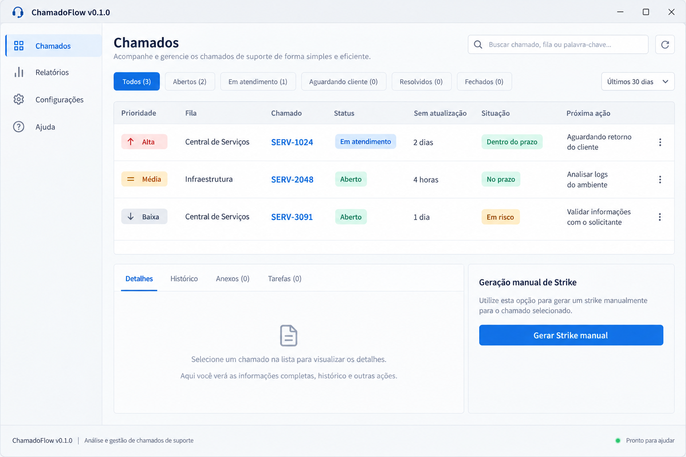

# ChamadoFlow

Aplicativo desktop em Python para analisar exportações XML de chamados, organizar prioridades e preparar mensagens de acompanhamento.

> Este repositório é uma versão demonstrativa e genérica do projeto. Ele não inclui dados reais, contatos, históricos, URLs internas ou exportações XML.



*Imagem ilustrativa com dados inteiramente fictícios.*

## Funcionalidades

- Leitura local de XMLs exportados por sistemas de chamados;
- classificação de situação, prioridade e próxima ação;
- regra configurável de Three Strikes e geração manual confirmada;
- modelos de mensagem para demandante, aprovador e equipe responsável;
- exportação das filas em Excel, com uma aba consolidada e outra para cada fila;
- base de contatos local e opcional;
- versionamento visível na janela, rodapé e no arquivo `VERSAO.txt` da release.

## Executar localmente

Requer Python 3.14 ou compatível.

```powershell
python -m venv .venv
.\.venv\Scripts\python.exe -m pip install -r requirements-dev.txt
Copy-Item config.example.json config.json
.\.venv\Scripts\python.exe main.py
```

`config.json` é local e não deve ser enviado ao Git.

## Estrutura do projeto

```text
src/chamadoflow/   # código-fonte do aplicativo
tests/             # testes automatizados
scripts/           # build da versão demonstrativa
assets/            # imagens usadas na documentação
docs/              # documentos do projeto
```

## Testes

```powershell
.\.venv\Scripts\python.exe -m pytest -p no:cacheprovider
```

## Gerar release portátil

```powershell
.\scripts\build_release.ps1
```

O resultado é `release/ChamadoFlow-vX.Y.Z.zip`, pronto para ser anexado a uma GitHub Release. O pacote contém somente o executável, suas dependências, a configuração de exemplo e a documentação pública.

## Versionamento

O projeto usa [Semantic Versioning](https://semver.org/lang/pt-BR/). A versão é definida exclusivamente em `src/chamadoflow/versao.py`.

## Licença

Distribuído sob a [licença MIT](LICENSE).

## Segurança e contribuições

Leia [SECURITY.md](SECURITY.md) e [CONTRIBUTING.md](CONTRIBUTING.md) antes de enviar alterações. O fluxo foi desenhado para impedir que dados do ambiente de trabalho cheguem ao repositório público.
